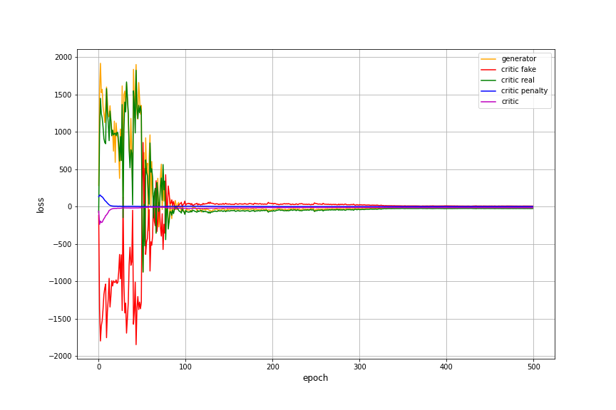

MuseGAN
=========
A Pytorch implementation of MuseGAN

[Check out the generated piano music](https://akanametov.github.io/musegan/)

:star: Star this project on GitHub — it helps!

[MuseGAN](https://arxiv.org/abs/1709.06298) is a generative model which allows to
generate music.

## Table of content

- [Training](#train)
- [License](#license)
- [Links](#links)

## Training 

See [demo](https://github.com/akanametov/musegan/blob/dev/demo/demo.ipynb) for more details of training process.
* The model components and utils are under `gan` folder.
* The Midi dataset is under `data/utils.py`.
* The MuseGAN model wrapper is under `musegan.py`.

To start training your own MuseGAN simply run `train.py` script with needed parameters.

##### `Generator` and `Critic` losses

## License

This project is licensed under MIT.

## Links

* [MuseGAN](https://arxiv.org/abs/1709.06298)
